# 基于STM32的四轴飞行器
>本项目基于**尚硅谷**开源学习
>
>原项目地址：[尚硅谷四轴无人机](https://www.bilibili.com/video/BV1rx4y1a7a1/?spm_id_from=333.337.search-card.all.click&vd_source=95764cfd8bb1371dc92f356cd7f2fb75)
>
>在此感谢原项目作者的杰出工作

## 项目预览

[跳转项目演示视频](https://www.bilibili.com/video/BV1RCw4zRELT/?vd_source=95764cfd8bb1371dc92f356cd7f2fb75)

## 项目功能


## 项目职责
* 编写IP5305T**电源管理**模块代码，实现电源开启后待机时长超过1min
* 编写4*LED**灯控任务**模块代码，组合显示飞行器遥控状态和飞机状态
* 编写8*KEY**按键任务**模块代码，按键分为长按和短按逻辑
* 编写**摇杆任务**模块代码，实现按键完成校准，中点对齐，微调等
* 编写SI24R1**通讯任务**模块代码，DIY无人机通讯协议，实现飞控和遥控之间的数据传输
* 编写**状态机任务**模块代码，其中油门解锁状态机用于设计摇杆解锁方式，飞行状态机设计飞机四种状态
* 编写OLED**显示任务**模块代码，在屏幕上显示摇杆数据及飞机状态
* 编写**飞控任务**模块代码，具体包括MPU6050读取原始数据，对角速度采用一阶低通滤波，加速度采用卡尔曼滤波，后四元数姿态解算得到欧拉角；
* 编写VL53L1X**定高任务**模块代码，实现对飞行器高度测量，最高4m
* 编写**串级PID控制系统**模块代码，飞控外环角度内环角速度，定高外环位置内环速度，PID参数整定，使得无人机能够抵抗外部干扰
***
## 关于开发环境
本项目控制核心采用STM32F103C8T6，移植FreeRTOS实时操作系统；

本次项目采用HAL库开发，CubeMX生成驱动文件，Keil+Vscode编译程序；

优点在于HAL库图形化配置便捷，可根据需求进行更改，使用VScode作为编辑器，可以用到AI插件，帮助代码补全，并且将文件放在工作区，方便编辑；而Keil则可以用来快速编译调试，可以用到Debug功能，设置断点方便调试代码；串口调试工具以及波形调试工具用到的是VOFA；
### 开发环境
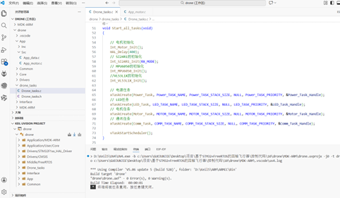
***
## 关于项目整体架构
项目整体分为飞控项目和遥控项目
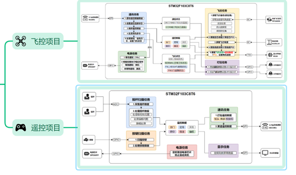
### 软件
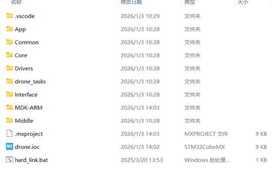
其中Middle为中间层，为项目移植FreeRTOS实时操作系统，进行任务调度

MDK-ARM为编译器，此次在这里我们选择了KEIL5作为编译器

INTERFACE为接口层，此处主要存放各个硬件设备的底层驱动代码
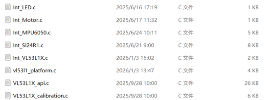
DRONE_TASK为任务调度层，在这里对各个任务的优先级进行调度及编写代码

DRIVES为驱动层，放置了STM32F103C8T6的固件库

CORE为核心层，放置了HAL库生成的驱动文件
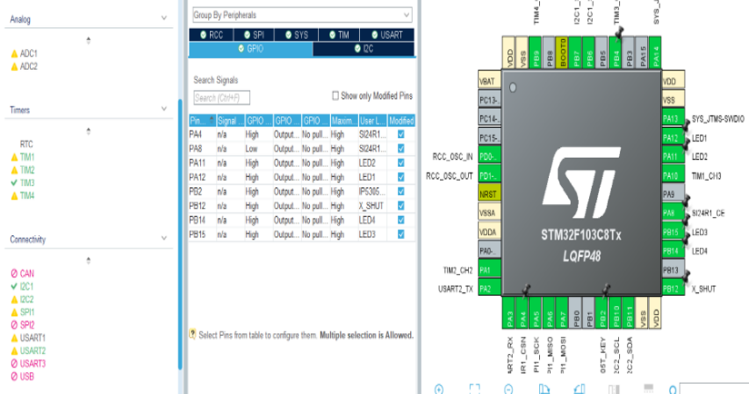
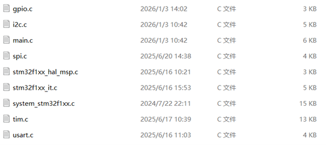
COMMON为中间层，放置了公共的结构体方便调用，同时串级PID代码，一阶低通滤波，卡尔曼滤波，四元数姿态解算的代码都放置在这里

APP为业务层，主要存放数据处理和电机驱动的PWM配置
***
## 关于电源任务
IP5305T 是一款集成升压转换器、锂电池充电管理、电池电量指示的多功能电源管理SOC，为移动电源提供完整的电源解决方案。
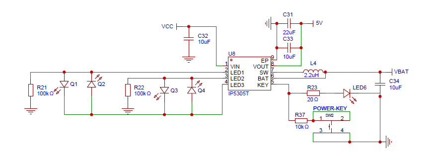
```
void Power_Task(void *param)       //定义电源任务函数
{
    printf("power task start");
    while (1)
    {
        // 再来一个10000ms的延时 意思是每隔10s钟 拉低一次
        vTaskDelay(10000);              //这个代码原本在断开后，此处前置不然相当于两次短按等于关机

        // 拉低，回到电源模式
        HAL_GPIO_WritePin(IP5305T_KEY_GPIO_Port, IP5305T_KEY_Pin, GPIO_PIN_RESET);
        // delay的时间按照手册来说 得在30ms以上
        vTaskDelay(100);
        // 再断开1，让它回到高阻态模式
        HAL_GPIO_WritePin(IP5305T_KEY_GPIO_Port, IP5305T_KEY_Pin, GPIO_PIN_SET);
    }                        //开机后待机能够撑过1分钟都不关机
}
```
***
## 关于灯控任务
需求：根据4个LED灯来显示遥控状态和飞控状态，其中前两个灯表示遥控状态，后俩个灯表示飞控状态
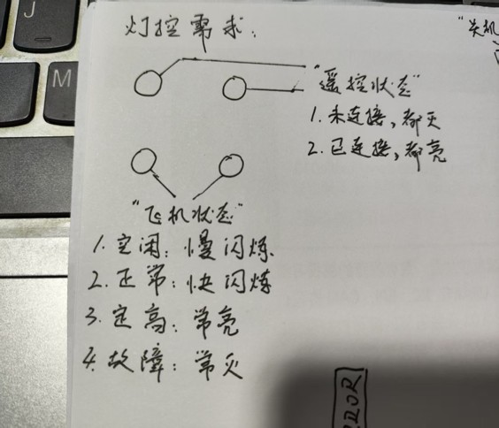
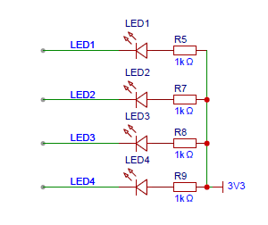
LED驱动采用句柄化封装，显得代码更加简洁
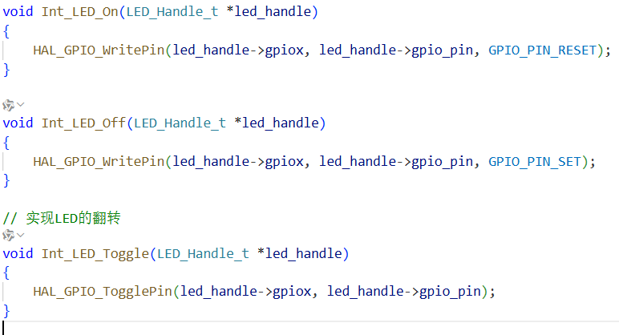
在公共层定义枚举类型，定义飞机遥控和飞控状态
```
typedef enum          //定义遥控状态，为枚举类型
{
    eRC_UNCONNECTED,    //未连接
    eRC_CONNECTED       //已连接
} RC_Status_e;

typedef enum          //定义飞机状态，为枚举类型
{
    eDrone_IDLE,           //定义空闲状态
    eDrone_NORMAL,         //定义正常工作状态
    eDrone_HOLD_HIGHT,     //定义定高状态
    eDrone_FAULT           //定义故障状态
} Drone_Status_e;
```
再通过switch函数实现灯光效果,其中慢闪烁和快闪烁可以用当前时间减去上一次的时间来判断，不会占用太多CPU内存，代码更好
```
case eDrone_IDLE:            //空闲状态  后两灯每隔1s闪烁(慢闪)
            // toggle一次后延时，可以实现效果，但是延长了刷新率
            if (xTaskGetTickCount() - bottom_led_last_toggle_tick >= 1000)    //用当前的时间减去上一次的时间
            {                                           
                Int_LED_Toggle(&led_left_bottom);
                Int_LED_Toggle(&led_right_bottom);
                bottom_led_last_toggle_tick = xTaskGetTickCount();      //翻转后更新以下当前的时间
            }               
            break;
        case eDrone_NORMAL:          //正常状态  后两灯每隔100ms闪烁(快闪)
            if (xTaskGetTickCount() - bottom_led_last_toggle_tick >= 100)
            {
                Int_LED_Toggle(&led_left_bottom);
                Int_LED_Toggle(&led_right_bottom);
                bottom_led_last_toggle_tick = xTaskGetTickCount();
            }
```
***
## 关于按键摇杆任务
需求：实现6个按键的8种效果，且与摇杆联动；摇杆根据位置输出0-1000的数据
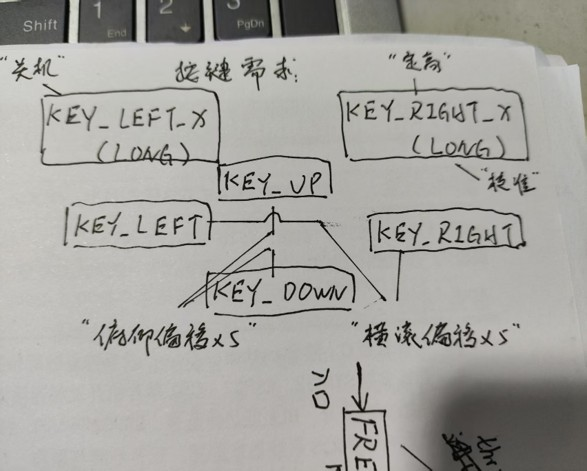
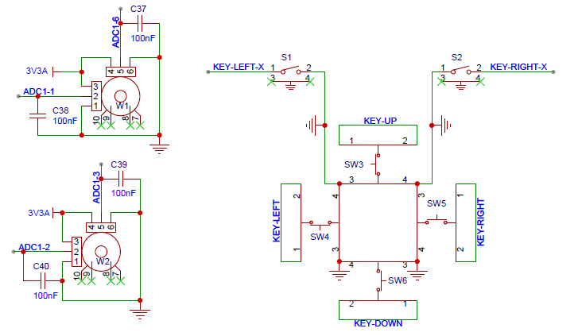
按键判断较为简单，采用简单的按键轮询方式即可，而摇杆ADC采集到的数据需要经过处理
```
// 2. 解决反向问题，思路：用4095减去当前值
    RCdata->pitch = 4095 - RCdata->pitch;
    RCdata->roll = 4095 - RCdata->roll;
    RCdata->yaw = 4095 - RCdata->yaw;            //注意偏航角没有反向的问题
    RCdata->throttle = 4095 - RCdata->throttle;

    // 3. 值域 0~1000，思路：当前值/ 4095 * 1000，为了避免浮点运算导致除完好永远为0，我们改成  当前值 * 1000 / 4095，
    RCdata->pitch = RCdata->pitch * 1000 / 4095;
    RCdata->roll = RCdata->roll * 1000 / 4095;
    RCdata->yaw = RCdata->yaw * 1000 / 4095;
    RCdata->throttle = RCdata->throttle * 1000 / 4095;                 //也可以当前值/4095.0 * 1000

    // 4. 减去校准偏移量                // 编写中点对齐代码，校正摇杆姿态初始角度，初始偏移量为0，摇杆校正时给偏移量赋值
    RCdata->pitch -= pitch_offset;
    RCdata->roll -= roll_offset;
    RCdata->yaw -= yaw_offset;
    RCdata->throttle -= throttle_offset;

    // 5. 俯仰加上我们的微调数据        // 添加微调代码，实现按键微调
    RCdata->pitch += pitch_adjust;         
    RCdata->roll += roll_adjust;

    // 6. 值域保护 (0~1000)          //即使校正后，摇杆数据依然是波动的，如果摇杆波动后数据小于偏移数据，则会出现负值，所以需要进行值域保护
    RCdata->pitch = LIMIT(RCdata->pitch, 0, 1000);
    RCdata->roll = LIMIT(RCdata->roll, 0, 1000);
    RCdata->yaw = LIMIT(RCdata->yaw, 0, 1000);
    RCdata->throttle = LIMIT(RCdata->throttle, 0, 1000);
    taskEXIT_CRITICAL();
```
### 测试视频
[按键测试视频](https://www.bilibili.com/video/BV158w8zwExV/?vd_source=95764cfd8bb1371dc92f356cd7f2fb75)
[摇杆测试视频](https://www.bilibili.com/video/BV1etw8zYEqZ/?vd_source=95764cfd8bb1371dc92f356cd7f2fb75)
***
## 关于通讯任务和状态机任务
通讯任务需求：通过2.4G无线通信将摇杆的数据传输到飞控板上，为了防止别人联上我们的飞机，需要DIY通讯协议，防止撞车
状态机任务需求：
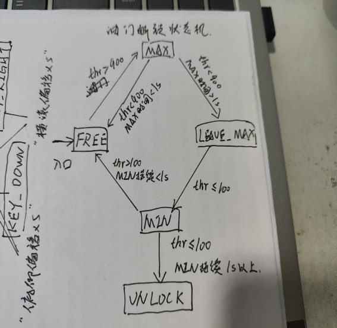
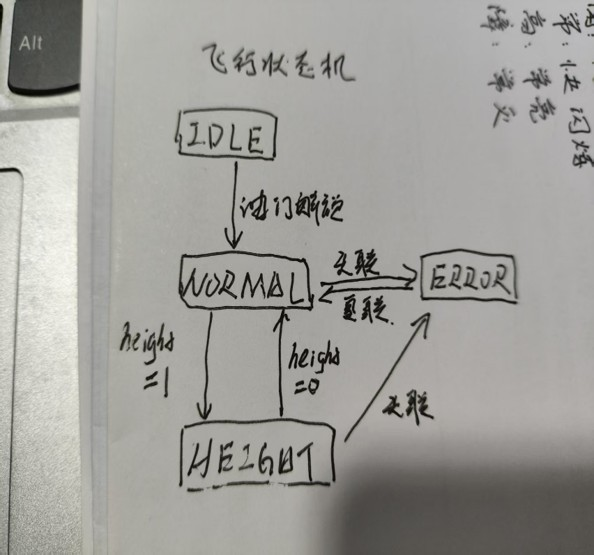
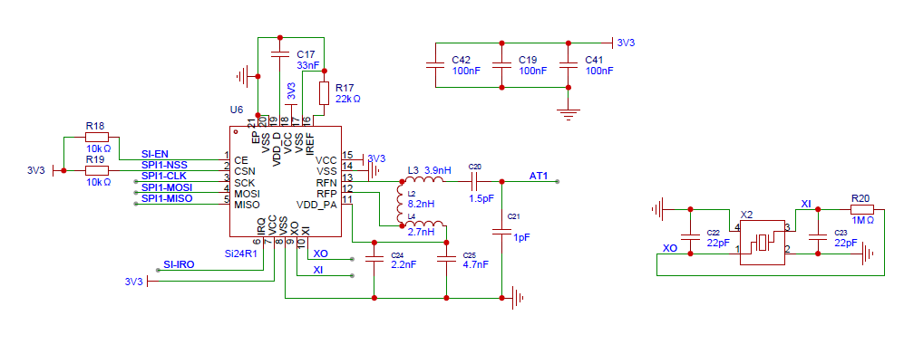
### DIY通讯协议
在遥控端，发送的数据缓冲包定义三个地址,作为第一层防护，再定义一种和校验逻辑作为第二层防护
```
 // DIY无人机通讯协议，第一层防护
    tx_buffer[10] = DIY_DRONE_ADDR0;
    tx_buffer[11] = DIY_DRONE_ADDR1;
    tx_buffer[12] = DIY_DRONE_ADDR2;            //无人机通讯软件协议，防止撞车
// 再发明一种和校验逻辑，第二层防护
    uint32_t check_sum = 0;                     //定义校验和
    for (uint8_t i = 0; i < 13; i++)
    {
        check_sum += tx_buffer[i];
    } 
    tx_buffer[13] = check_sum >> 24;
    tx_buffer[14] = check_sum >> 16;
    tx_buffer[15] = check_sum >> 8;
    tx_buffer[16] = check_sum & 0xff;            //无人机校验和通讯协议，防止撞车
```
对应飞控端，接受的数据缓冲包需要先进行校验，在通过两层的防护措施后，才接受数据，这样确保接受数据不会出错
```
if (res == 0)          // 如果接收到数据
    {                      //第一步进行无人机DIY通讯协议地址鉴定，防止撞车，第一层防护
        if ((rx_buffer[10] == DIY_DRONE_ADDR0) && (rx_buffer[11] == DIY_DRONE_ADDR1) && (rx_buffer[12] == DIY_DRONE_ADDR2))
        {                  //第二步进行和校验，防止撞车，第二层防护
            uint32_t check_sum = 0;
            for (uint8_t i = 0; i < 13; i++)
            {
                check_sum += rx_buffer[i];
            }
            if (check_sum == ((rx_buffer[13] << 24) | (rx_buffer[14] << 16) | (rx_buffer[15] << 8) | rx_buffer[16]))    
            {
                // 才认为这是合规数据，通过了两层DIY无人机通讯协议的防护，才进行数据解析
                rc_data->throttle = (rx_buffer[0] << 8) | rx_buffer[1];
                rc_data->pitch = (rx_buffer[2] << 8) | rx_buffer[3];
                rc_data->roll = (rx_buffer[4] << 8) | rx_buffer[5];
                rc_data->yaw = (rx_buffer[6] << 8) | rx_buffer[7];
                rc_data->off = rx_buffer[8];
                rc_data->hold_height = rx_buffer[9];
                return eData_Valid;             // 数据有效，返回数据有效枚举值
            }
        }
    }
```
### 测试视频
[通讯联调测试视频](https://www.bilibili.com/video/BV1K2w8znEAb/?vd_source=95764cfd8bb1371dc92f356cd7f2fb75)
[油门解锁状态机测试视频](https://www.bilibili.com/video/BV1PDw8zmE57/?vd_source=95764cfd8bb1371dc92f356cd7f2fb75)
[飞行状态机测试视频](https://www.bilibili.com/video/BV1sSw8zEEVW/?vd_source=95764cfd8bb1371dc92f356cd7f2fb75)
***


>再次感谢原项目作者的杰出工作
>
>同时也欢迎大家一起来学习
>
***
后面会继续更新，请等待...
